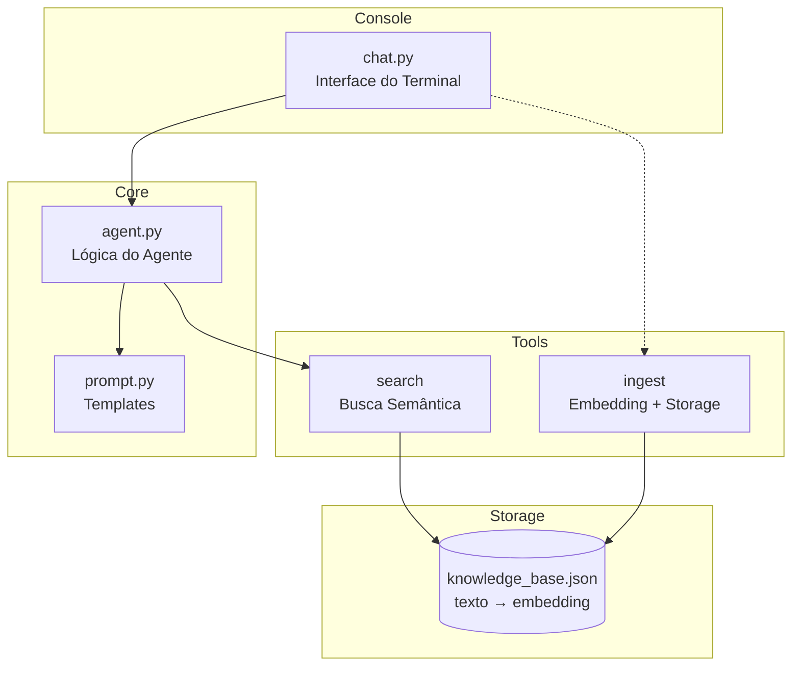

# Agente de Console com RAG (Retrieval-Augmented Generation)

Construir um agente de terminal com capacidade de chat, ingestão de documentos (embeddings) e busca semântica. O agente utiliza RAG para enriquecer as respostas.

## Arquitetura Proposta



---

## Proposed Changes

### Tools Layer

#### [NEW] [tools.py](file:///home/fbotero/Documents/Estudos/IA_Agents/tools.py)

Implementar as ferramentas do agente:

1. **`ingest(text: str, source: str = None)`**
   - Gera embedding do texto usando a API do Google
   - Armazena em `knowledge_base.json` como `{text, embedding, source, timestamp}`
   - Retorna confirmação

2. **`search(query: str, top_k: int = 3)`**
   - Gera embedding da query
   - Calcula similaridade de cosseno com todos os embeddings armazenados
   - Retorna os `top_k` textos mais relevantes

3. **`load_knowledge_base()` / `save_knowledge_base()`**
   - Funções auxiliares para persistência em JSON

---

### Prompt Layer

#### [NEW] [prompt.py](file:///home/fbotero/Documents/Estudos/IA_Agents/prompt.py)

Templates estruturados:

```python
SYSTEM_PROMPT = """
{tone_instruction}

## Contexto Recuperado
{retrieved_context}

## Instruções
- Use o contexto acima para enriquecer sua resposta
- Se não houver contexto relevante, responda com seu conhecimento geral
- Seja claro e direto
"""

USER_PROMPT = "{user_question}"
```

---

### Agent Layer

#### [NEW] [agent.py](file:///home/fbotero/Documents/Estudos/IA_Agents/agent.py)

Lógica central do agente:

1. **`Agent` class**
   - `__init__(tone: str)` - Configura o tom do agente
   - `process(user_input: str)` - Fluxo principal:
     1. Faz busca no knowledge base
     2. Monta o prompt com tom + contexto + pergunta
     3. Chama a LLM (Google Gemini)
     4. Retorna a resposta

2. **Integração com tools**
   - `ingest_document(text, source)` - Wrapper para a tool de ingest
   - `search_knowledge(query)` - Wrapper para a tool de search

---

### Chat Layer

#### [NEW] [chat.py](file:///home/fbotero/Documents/Estudos/IA_Agents/chat.py)

Interface de terminal:

1. **Loop principal de chat**
   - Prompt interativo com readline
   - Comandos especiais:
     - `/ingest <texto>` - Ingere texto diretamente
     - `/ingest_file <caminho>` - Ingere arquivo
     - `/search <query>` - Busca direta (sem chat)
     - `/clear` - Limpa histórico
     - `/exit` ou `/quit` - Sair

2. **Formatação rica**
   - Cores para diferenciar usuário/agente
   - Indicador de "pensando..."

---

### Configuration

#### [NEW] [config.py](file:///home/fbotero/Documents/Estudos/IA_Agents/config.py)

Arquivo de configuração:
- Tom padrão do agente
- Caminho do knowledge base
- Parâmetros de busca (top_k)

---

### Dependencies

#### [MODIFY] [requirements.txt](file:///home/fbotero/Documents/Estudos/IA_Agents/requiriments.txt)

```
google-generativeai>=0.3.0
numpy
python-dotenv
```

> [!NOTE]
> O arquivo será renomeado para `requirements.txt` (typo no nome atual)

---

## User Review Required

> [!IMPORTANT]
> **Qual modelo do Google deseja usar?**
> - `gemini-1.5-flash` (mais rápido, mais barato)
> - `gemini-1.5-pro` (mais capaz)

> [!IMPORTANT]
> **Qual tom/personalidade o agente deve ter por padrão?**
> Exemplo: "Você é um assistente técnico prestativo e direto. Responda de forma clara e objetiva."

---

## Verification Plan

### Manual Testing

1. **Testar ingestão:**
   ```bash
   python chat.py
   # No chat:
   /ingest Este é um documento de teste sobre Python
   /ingest Python é uma linguagem de programação versátil
   ```

2. **Testar busca direta:**
   ```bash
   /search linguagem programação
   # Deve retornar os textos relevantes
   ```

3. **Testar chat com RAG:**
   ```bash
   # Perguntar algo relacionado ao conteúdo ingerido
   O que você sabe sobre Python?
   # A resposta deve usar o contexto recuperado
   ```

4. **Verificar persistência:**
   ```bash
   # Sair e reabrir
   /exit
   python chat.py
   /search Python
   # Deve encontrar os documentos anteriores
   ```
