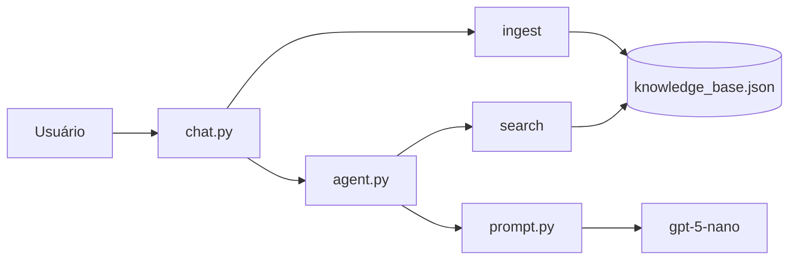

# Agente RAG de Console - Walkthrough

## Arquivos Criados

| Arquivo | Descrição |
|---------|-----------|
| [tools.py](file:///home/fbotero/Documents/Estudos/IA_Agents/tools.py) | Ferramentas `ingest` e `search` com embeddings OpenAI |
| [prompt.py](file:///home/fbotero/Documents/Estudos/IA_Agents/prompt.py) | Templates de prompt com tom, contexto e pergunta |
| [agent.py](file:///home/fbotero/Documents/Estudos/IA_Agents/agent.py) | Lógica do agente RAG separada da interface |
| [chat.py](file:///home/fbotero/Documents/Estudos/IA_Agents/chat.py) | Interface de terminal com comandos |
| [requirements.txt](file:///home/fbotero/Documents/Estudos/IA_Agents/requirements.txt) | Dependências do projeto |

---

## Arquitetura



---

## Como Usar

### 1. Instalar dependências
```bash
pip install -r requirements.txt
```

### 2. Executar o chat
```bash
python3 chat.py
```

### 3. Comandos disponíveis

| Comando | Descrição |
|---------|-----------|
| `/ingest <texto>` | Ingere texto na base de conhecimento |
| `/ingest_file <path>` | Ingere arquivo na base |
| `/search <query>` | Busca direta (sem chat) |
| `/clear` | Limpa histórico da conversa |
| `/help` | Mostra comandos |
| `/exit` | Sair |

### 4. Chat normal
Qualquer texto sem `/` é processado pelo agente com RAG:
1. Busca contexto relevante na base
2. Monta prompt com tom + contexto + pergunta
3. Envia para a LLM e retorna resposta

---

## Verificação

- ✅ Sintaxe de todos os arquivos validada
- ✅ `.env` corrigido para usar `OPENAI_API_KEY`
